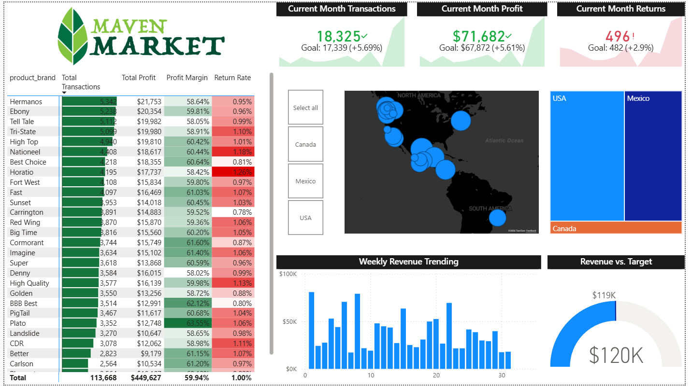

# 📊 Maven Market Report (Power BI)

## 🧭 Project Overview

This project analyzes the sales performance of a market chain, emphasizing on the profit margin and return rate of each product brand, transactions in each region, as well as the importance in the scaling of the weekly revenue.

---

## 📚 Learning Context

This Power BI project was developed as part of the "Microsoft Power BI Desktop for Business Intelligence" course on Udemy, during Oct-Nov/2025.

The goal of the project was to learn how to quickly create a simple dashboard, as well as to practice:
- data modeling
- formatting options

---

## 🖼️ Dashboard Preview

### Topline Performance



---

## 🎯 Business Approach

Taking a look at the data from a business point of view, this project also aims to answer key questions, such as:

* Is the current profit and revenue of the company higher than last month's?
* Are this month's returns less than last month's?
* Which product brand's products are bought the most?
* Which regions and cities sell the most?

---

## 📁 Dataset Source

The dataset used in this project was provided in the course and is based on the "Maven Market" dataset, which is a free and publicly available dataset.

---

## 🧩 Data Model

A structured data model was implemented in Power BI to optimize analysis. The data model of this project consists of 2 smaller ones, since the dataset consists of 2 fact tables. The data models use the Star Schema approach.

Key components:

* Fact tables: **Transaction Data**, **Return Data**
* Dimension tables (Lookup tables):

  * Calendar
  * Products
  * Customers
  * Stores
  * Regions

Relationships between the fact and dimension tables were created, in order to support **time-based and categorical analysis**.

Through the data analysis, an extra **Measure Table** has been created and added to the final data model, which contains all measures created in folders.

---

## 🧮 Key Measures (DAX)

Identifying KPIs that we can make the most out of this dataset is an essential part of the project. The most important KPIs, which are also displayed at the top of the dashboard, are:

* Transactions
* Profit
* Returns

Those KPIs were calculated using DAX functions in Power BI:

```DAX
Total Transactions = COUNTROWS(Transaction_Data)

Total Profit = [Total Revenue] - [Total Cost]

Total Returns = COUNTROWS(Return_Data)
```

---

## ✨ Dashboard Features

The dashboard includes:

* **Current month's KPIs**
* **Key measures for each product brand**
* **Map with regional sales**
* **Weekly revenue trending**
* **Filtering across visuals**

---

## 🔍 Key Insights

Some insights identified from the analysis:

* This month the company made **bigger profit**, but had **more returns**.
* Across data from all cities, **Hidalgo** had the most transactions.
* This month the **revenue target was hit**.
